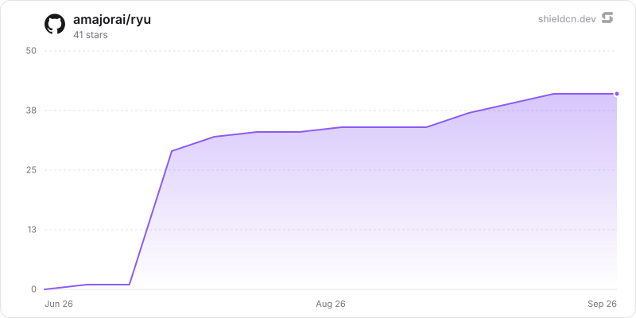

<p align="center">
  <a href="https://ryuhq.com">
    <picture>
      <source media="(prefers-color-scheme: dark)" srcset=".github/banner-dark.png" />
      
    </picture>
  </a>
</p>

<p align="center"></p>
<h1 align="center">Ryu</h1>

<p align="center">
  Build and run AI agents without starting from scratch. Extend capability with plugins, or turn agents into apps.
</p>

<p align="center">
  <a href="https://github.com/amajorai/ryu/stargazers"></a>&nbsp;
  <a href="https://github.com/amajorai/ryu/releases"></a>&nbsp;
  <a href="https://github.com/amajorai/ryu/actions/workflows/ci.yml"></a>
</p>

<p align="center">
  <a href="https://docs.ryuhq.com"></a>&nbsp;
  <a href="https://ryuhq.com/download"></a>&nbsp;
  <a href="https://ryuhq.com/discord"></a>&nbsp;
  <a href="https://x.com/ryuhq"></a>&nbsp;
  <a href="./LICENSING.md"></a>
</p>

## How the pieces connect

The same contracts connect the runtime, integration seams, surfaces, and deployment choices.

Build with SDKs, Core, Gateway, apps, plugins, and APIs. Run Ryu locally, on your own server, or in
Ryu Cloud through Desktop, Web, browser, mobile, CLI, bots, and channels.

This repository contains Core, Gateway, CLI, Desktop, Island, shared runtime packages, and
self-hosting files. SDKs and examples live in the [public SDK hub](https://github.com/amajorai/ryu-sdk);
app source lives in its `ryu-<app>` satellite; plugin source and the catalog live in the
[Marketplace repository](https://github.com/amajorai/ryu-marketplace). The full product
documentation is at [docs.ryuhq.com](https://docs.ryuhq.com).

## How Ryu compares

These tables compare documented product surfaces, not model quality, latency, or security
certification.

Legend: ✅ first-class documented capability · 🟡 available through composition, configuration, or
a limited/preview surface · ❌ not the product's primary documented surface.

### Agent frameworks and local runtimes

| Capability | [Ryu](https://github.com/amajorai/ryu) | [DeepSeek Harness](https://github.com/deepseek-ai/deepseek-harness) | [Mastra](https://mastra.ai/ai-agents) | [LangChain / LangGraph](https://www.langchain.com/) | [eve](https://eve.dev/) | [OpenClaw](https://github.com/openclaw/openclaw) | [Hermes Agent](https://github.com/NousResearch/hermes-agent) | [Omnigent](https://github.com/omnigent-ai/omnigent) |
| --- | --- | --- | --- | --- | --- | --- | --- | --- |
| Use an existing agent or harness | ✅ | ❌ | ❌ | ❌ | ❌ | ❌ | 🟡 | ✅ |
| BYO models and providers | ✅ | ✅ | ✅ | ✅ | ✅ | ✅ | ✅ | ✅ |
| Local or self-hosted runtime | ✅ | ✅ | ✅ | ✅ | ✅ | ✅ | ✅ | ✅ |
| Managed hosting | ✅ | ❌ | 🟡 | ✅ | 🟡 | ❌ | 🟡 | 🟡 |
| Multi-agent coordination | ✅ | ✅ | ✅ | ✅ | ✅ | ✅ | ✅ | ✅ |
| Durable workflows and triggers | ✅ | ✅ | ✅ | ✅ | ✅ | ✅ | ✅ | 🟡 |
| Tools and MCP | ✅ | ✅ | ✅ | ✅ | ✅ | ✅ | ✅ | ✅ |
| Memory and retrieval | ✅ | 🟡 | ✅ | ✅ | 🟡 | ✅ | ✅ | 🟡 |
| Routing, budgets, approvals, and audit | ✅ | 🟡 | 🟡 | 🟡 | 🟡 | 🟡 | 🟡 | ✅ |
| Sandboxed execution | ✅ | ✅ | 🟡 | 🟡 | ✅ | 🟡 | 🟡 | ✅ |
| Background schedules | ✅ | ✅ | ✅ | 🟡 | ✅ | ✅ | ✅ | 🟡 |
| CLI, app, and channel delivery | ✅ | 🟡 | 🟡 | 🟡 | ✅ | ✅ | ✅ | ✅ |
| Skills, plugins, and integrations | ✅ | ✅ | 🟡 | ✅ | ✅ | ✅ | ✅ | 🟡 |

### Managed agent products and cloud platforms

| Capability | [Ryu](https://github.com/amajorai/ryu) | [Claude Managed Agents](https://platform.claude.com/docs/en/managed-agents/overview) | [Notion Custom Agents](https://www.notion.com/help/custom-agents) | [Grok Bot](https://x.ai/bot) | [Hyperagent](https://www.hyperagent.com/docs/get-started) | [Vercel AI Cloud](https://vercel.com/agents) | [ChatGPT Workspace Agents](https://help.openai.com/en/articles/20001143-chatgpt-workspace-agents-for-enterprise-and-business) | [Microsoft Foundry](https://learn.microsoft.com/en-us/azure/foundry/agents/overview) | [Vertex AI Agent Engine](https://docs.cloud.google.com/vertex-ai/generative-ai/docs/agent-engine/overview) |
| --- | --- | --- | --- | --- | --- | --- | --- | --- | --- |
| Use an existing agent or harness | ✅ | 🟡 | ❌ | ❌ | 🟡 | 🟡 | ❌ | ✅ | ✅ |
| BYO models and providers | ✅ | ❌ | 🟡 | ❌ | 🟡 | ✅ | 🟡 | 🟡 | 🟡 |
| Local or self-hosted runtime | ✅ | 🟡 | ❌ | ❌ | ❌ | ❌ | ❌ | 🟡 | 🟡 |
| Managed hosting | ✅ | ✅ | ✅ | ✅ | ✅ | ✅ | ✅ | ✅ | ✅ |
| Multi-agent coordination | ✅ | ✅ | 🟡 | 🟡 | ✅ | 🟡 | 🟡 | ✅ | ✅ |
| Tools and MCP | ✅ | ✅ | ✅ | 🟡 | ✅ | ✅ | ✅ | ✅ | 🟡 |
| Memory and retrieval | ✅ | ✅ | ✅ | ❌ | ✅ | 🟡 | 🟡 | 🟡 | ✅ |
| Routing, budgets, approvals, and audit | ✅ | 🟡 | ✅ | 🟡 | ✅ | 🟡 | 🟡 | ✅ | 🟡 |
| Sandboxed execution | ✅ | ✅ | ❌ | 🟡 | 🟡 | ✅ | 🟡 | 🟡 | 🟡 |
| Background schedules and triggers | ✅ | ✅ | ✅ | ✅ | ✅ | ✅ | ✅ | 🟡 | 🟡 |
| CLI, app, and channel delivery | ✅ | 🟡 | ✅ | ✅ | ✅ | 🟡 | ✅ | 🟡 | 🟡 |
| Skills, plugins, and integrations | ✅ | ✅ | ✅ | 🟡 | ✅ | 🟡 | ✅ | ✅ | 🟡 |

## Quick Start

Run Core and Gateway on infrastructure you control. No Ryu account or control-plane service is
required.

**macOS and Linux**:

```bash
curl -fsSL https://raw.githubusercontent.com/amajorai/ryu/main/install.sh | sh
ryu-cli
```

**Windows PowerShell**:

```powershell
irm https://raw.githubusercontent.com/amajorai/ryu/main/install.ps1 | iex
ryu-cli
```

The installer starts Core and Gateway with bundled local defaults. See the
[self-hosting guide](https://docs.ryuhq.com/docs/start-here/getting-started/self-host)
for providers, deployment, and configuration.

## Licensing

Core and SDK are Apache-2.0. Gateway is AGPL-3.0. Desktop, Island, and shared UI packages are
source-available under [`LICENSE-COMMERCIAL.md`](./LICENSE-COMMERCIAL.md). See
[`LICENSING.md`](./LICENSING.md) and [`TRADEMARK.md`](./TRADEMARK.md) for the full boundary.

Ryu is pre-1.0. Interfaces, APIs, and on-disk formats may change between releases.

## Contributing

Open a pull request in this repository to contribute code or docs; start with the
[contribution guide](./CONTRIBUTING.md). Use the [SDK hub](https://github.com/amajorai/ryu-sdk)
for SDKs and bindings, the relevant `ryu-<app>` satellite for apps, and the
[Marketplace repository](https://github.com/amajorai/ryu-marketplace) for plugins. Report security
issues through [SECURITY.md](./.github/SECURITY.md).

## Star History

<a href="https://github.com/amajorai/ryu/stargazers">
  <picture>
    <source media="(prefers-color-scheme: dark)" srcset="./.github/shieldcn/star-chart-dark.svg" />
    
  </picture>
</a>
