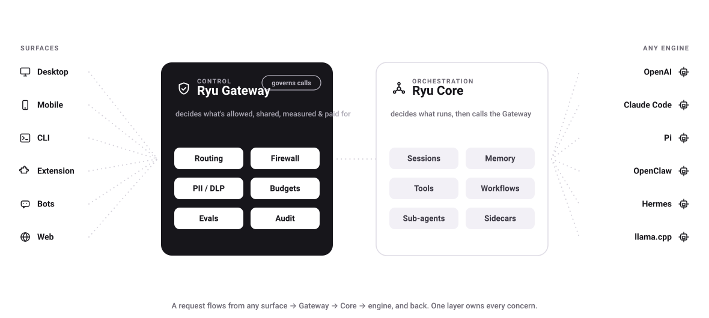

<p align="center">
  <a href="https://ryuhq.com">
    <picture>
      <source media="(prefers-color-scheme: dark)" srcset=".github/banner-dark.png" />
      
    </picture>
  </a>
</p>

<p align="center"></p>
<h1 align="center">Ryu</h1>

<p align="center">
  The universal agent interface &amp; open composable platform for agent orchestration and knowledge sharing.
  Build plugins that extend capabilities, and apps that leverage pre-built primitives.
  Ryu is not another agent — it's the whole infrastructure layer.
</p>

<p align="center">
  &nbsp;
  &nbsp;
  &nbsp;
  
</p>

<p align="center">
  <a href="https://www.npmjs.com/package/@ryuhq/client"></a>&nbsp;
  <a href="https://www.npmjs.com/package/@ryuhq/client"></a>&nbsp;
  <a href="https://github.com/amajorai/ryu/releases"></a>&nbsp;
  <a href="https://github.com/amajorai/ryu/releases"></a>&nbsp;
  <a href="https://github.com/amajorai/ryu/stargazers"></a>
</p>

<p align="center">
  <a href="https://ryuhq.com"></a>&nbsp;
  <a href="https://ryuhq.com/help"></a>&nbsp;
  <a href="https://ryuhq.com/download"></a>&nbsp;
  <a href="https://ryuhq.com/discord"></a>
  <a href="./docs/open-core.md"></a>
</p>

## Backed by

Ryu is built with the support of leading startup programs.

<p align="center">
  <a href="https://aws.amazon.com/startups/" target="_blank" rel="noopener"></a>
  &nbsp;&nbsp;&nbsp;&nbsp;&nbsp;
  <a href="https://block71.co" target="_blank" rel="noopener"></a>
  &nbsp;&nbsp;&nbsp;&nbsp;&nbsp;
  <a href="https://www.anthropic.com/startups" target="_blank" rel="noopener"></a>
  &nbsp;&nbsp;&nbsp;&nbsp;&nbsp;
  <a href="https://openai.com/startups" target="_blank" rel="noopener"></a>
  &nbsp;&nbsp;&nbsp;&nbsp;&nbsp;
  <a href="https://www.cloudflare.com/forstartups/" target="_blank" rel="noopener"></a>
</p>

<p align="center">
  <sub>AWS Activate&nbsp; · &nbsp;BLOCK71&nbsp; · &nbsp;Claude for Startups&nbsp; · &nbsp;OpenAI for Startups&nbsp; · &nbsp;Cloudflare for Startups</sub>
</p>

## About Ryu

Every team building with AI rebuilds the same layers from scratch — agents, memory,
RAG, model routing, sandboxes, voice, tools. Every agent, app, and framework
reinvents them in isolation, then locks its users in.

Ryu is not another agent. It's the **infrastructure layer** underneath the whole AI
tooling ecosystem: an open, composable platform that turns those layers — the ones
everyone rebuilds over and over again — into **primitives**. Local AI is exposed as
building blocks you can assemble into apps, extend with plugins, and drive from any
language, SDK, or framework. One universal interface that unifies the fragmented
ecosystem instead of adding to it:

- **Works with any existing agent.** Claude Code, Codex, OpenClaw, Pi, Hermes — any
  ACP or OpenAI-compatible runtime. One Gateway, shared context, stacked subscriptions.
- **Works with any integration.** Every MCP server, Composio account, and skill from
  any ecosystem, importable in one click.
- **Works with any language, SDK, or framework.** TypeScript and Rust SDKs, plus C,
  Node, Python, Go, Swift, Kotlin, and C# bindings.
- **Build on top of it.** Compose pre-built primitives into apps, or write plugins
  that extend capabilities. The Ryu Marketplace distributes both — signed and governed.

Local-first, encrypted, no telemetry. **Works with everything. Locked to nothing.**

> [!WARNING]
> Ryu is pre-1.0 and under active development. Interfaces, APIs, and on-disk formats may change between releases. Not recommended for production use yet.

## Features

- **Agent teams** — named, ordered multi-agent teams with a shared coordination strategy; one conversation routes across members.
- **Workflows** — durable, crash-recoverable multi-step workflows with a visual builder, templates, and resumable runs.
- **Model routing** — 400+ models from local to cloud, routed by capability, cost, and eval score through one Gateway. Cheap tasks stay local; cloud handles only what needs it.
- **Built on Pi** — the flagship "Ryu" agent runs on Pi, the open agent runtime, with the Gateway on top. Bring your own engine and swap it anytime.
- **Integrate everywhere** — an MCP Gateway, an OpenAI-compatible API, and native channels for Telegram, Slack, WhatsApp, and Discord.
- **Works with any existing agent** — via ACP: Claude Code, Codex, OpenClaw, Pi, Hermes, and ~30 more, installable from the catalog.
- **Works with any integration** — every MCP server, Composio tool, and API-backed integration, governed by one firewall and grant system.
- **Skill import** — import skills from Claude, Cursor, and the wider ecosystem into one catalog with progressive-disclosure injection into any agent.
- **Ryu Marketplace** — signed plugins and apps (ed25519 + moderation) installable with `ryu add`, alongside file-based definitions you can version in git.

## Why Ryu

- **Agents that know what each other did.** Shared memory and context across every surface — desktop, mobile, CLI, bots, web.
- **Your subscriptions, fully used.** Point Claude Code, Codex, and Gemini at one Gateway. Smart routing keeps cheap tasks on local models; cloud handles only what needs it.
- **Secure out of the box.** Firewall, prompt-injection protection, PII/DLP redaction, per-agent budgets, and a full audit trail — not bolted on, built in.
- **One-click setup.** Pick an agent from the catalog, install, and go. No MCP wiring, no API-key hunt, no week-long integration.
- **Works with everything, locked to nothing.** Every layer — model, embedder, reranker, engine, RAG strategy, sandbox — swaps via one registry. BYO agent, key, subscription.

## Architecture

<picture>
  <source media="(prefers-color-scheme: dark)" srcset=".github/architecture-dark.svg">
  
</picture>

**The one design rule:** if code decides *what runs* (which agent, session, workflow, tool), it is
**Core**. If it decides *what is allowed, shared, measured, or paid for*, it is **Gateway**. Core
never enforces policy inline — it routes every model call through the Gateway.

### Decomposition

Core and the Gateway were decomposed from a monolith into a virtual Cargo workspace of **~75
crates**: 52 primitive + app-backend capability crates (43 `crates/ryu-*` capabilities — crypto,
vault, downloads, engines, RAG, memory, search, durable, voice, image, sandbox… + 9 app backends),
11 gateway-stage crates (`crates/ryu-gw-*`), plus the ghost/shadow automation crates. Alongside
them live 21 self-contained apps under `apps-store/*` (16 with UI companions). `apps/core` shrank
from ~195k to ~143k LoC (−27%); ~88k LoC now lives in swappable crates.

Every layer is a swappable default, never a lock — chat model, embedder, reranker, TTS/STT,
image-gen, engine, RAG strategy, durable engine, sandbox. This repository carries the **open-core
subset** (`apps/core`, `apps/gateway`, the CLI/TUI clients, and the public capability + SDK crates
listed below) **plus a source-available tier** — `apps/desktop`, `apps/island`, and the shared UI
packages — under [`LICENSE-COMMERCIAL.md`](./LICENSE-COMMERCIAL.md). The web, server, mobile,
extension, and identity/billing surfaces remain proprietary and are not part of this mirror.

## Quick start (self-host)

### Install (prebuilt binaries)

One line pulls the headless stack — `ryu-core`, `ryu-gateway`, `ryu-cli` — into
`~/.ryu/bin`, puts it on your PATH, and starts Core so the bundled defaults can begin
provisioning. Great for servers, containers, and CI.

**macOS & Linux** (x86_64 Linux, Apple Silicon macOS):

```bash
curl -fsSL https://raw.githubusercontent.com/amajorai/ryu/main/install.sh | sh
```

**Windows** (x86_64, PowerShell):

```powershell
irm https://raw.githubusercontent.com/amajorai/ryu/main/install.ps1 | iex
```

The installer waits for Core to become healthy, then the bundled models, engines, and
skills continue downloading in the background. Island and Ghost are intentionally not
installed by default yet. Attach with the CLI:

```bash
ryu-cli      # attaches to the Core started by the installer — no API key
```

Or start the node yourself and point clients at it:

```bash
ryu-core     # restart Core; it brings up the Gateway + local defaults
```

## GitHub Actions

Use the bundled Ryu action from any workflow to validate a self-hosted or managed
node, run an agent/team/workflow, or call an allowlisted tool:

```yaml
- uses: amajorai/ryu@v1
  with:
    target: managed
    managed-node-url: ${{ secrets.RYU_MANAGED_NODE_URL }}
    managed-node-token: ${{ secrets.RYU_MANAGED_NODE_TOKEN }}
    operation: run
    agent: review-agent
    prompt: Review the current release candidate.
```

See the [GitHub Actions documentation](https://docs.ryuhq.com/docs/ci/github-actions)
for setup, tool calls, outputs, and security behavior.

<sub>Prebuilt targets: Linux x86_64, macOS Apple Silicon, Windows x86_64. On Intel
Macs or ARM Linux, build from source below. Override the install dir with
`RYU_INSTALL_DIR` or pin a release with `RYU_VERSION=v0.0.4`.</sub>

### Build from source

```bash
cd apps/core    && cargo build --release   # ryu-core    :7980
cd apps/gateway && cargo build --release   # ryu-gateway :7981
```

Point any OpenAI-compatible client at the Gateway's `/v1/chat/completions`.

On first run, Ryu downloads a fully-local stack (llama.cpp with Gemma 4 for chat, nomic embeddings, whisper for speech), so it works with **no API key**.

Swap any piece later: model, embedder, engine, and RAG strategy are all config.

The TypeScript units (SDK, docs) use [Bun](https://bun.sh):

```bash
bun install && bun run build
```

### One-click deploy

Stand up a hosted node (Core + Gateway) on a container host. Each builds the
[`Dockerfile`](./Dockerfile): Core runs the stack and manages the Gateway on
loopback, so only Core's port is published.

[](https://render.com/deploy?repo=https://github.com/amajorai/ryu)
&nbsp;
[](https://railway.com/new)
&nbsp;
[](https://cloud.digitalocean.com/apps/new?repo=https://github.com/amajorai/ryu/tree/main)

Or run it yourself:

- **Docker Compose** — `docker compose up --build` ([`docker-compose.yml`](./docker-compose.yml)): Core on `:7980`, Gateway on `:7981`, model state in a named volume.
- **Fly.io** — `fly launch --copy-config` then `fly deploy` ([`fly.toml`](./fly.toml)).

> **Sizing.** Core downloads a fully-local model stack on first boot, so pick a
> plan with **≥ 2 GB RAM** (4 GB is comfortable), or set a provider key such as
> `OPENAI_API_KEY` to skip the local download and run small.
>
> **License.** The Gateway is **AGPL-3.0**: host a *modified* Gateway and §13
> obliges you to offer those changes to its users. Core is Apache-2.0.

The documentation site lives in its own repo, [`amajorai/ryu-docs`](https://github.com/amajorai/ryu-docs)
(Next.js), and deploys to Vercel in one click — [](https://vercel.com/new/clone?repository-url=https://github.com/amajorai/ryu-docs&project-name=ryu-docs). Vercel is serverless and cannot host the long-running Core/Gateway; use a container host above for the backend.

## Batteries-included defaults (all swappable)

- **Engine/model:** llama.cpp + Gemma 4 — runs on most machines, no key.
- **Default agent:** **"Ryu"** = Pi with the Gateway on top (the flagship "car around the engine"). Claude Code, Codex, Gemini CLI, OpenClaw, Hermes, and ~18 more ACP agents are opt-in via the catalog.
- **RAG:** local nomic embeddings + BGE reranker; vector + GraphRAG.
- **Modalities:** chat, image-gen, TTS, STT — all first-class, all swappable.
- **Standards:** Agent Skills + MCP + ACP, all first-class.

## Repository layout

This mirror ships **two tiers**, and the difference matters. Each unit carries its own
`LICENSE`; the full map is in [`LICENSING.md`](./LICENSING.md).

1. **Open source** — the orchestration engine, the Gateway, the terminal clients, and the
   public capability + SDK crates. Apache-2.0 (Gateway: AGPL-3.0, Raycast: MIT).
2. **Source-available** — `apps/desktop`, `apps/island`, and the shared UI packages they
   cannot compile without, under [`LICENSE-COMMERCIAL.md`](./LICENSE-COMMERCIAL.md).
   **This is not open source.** You may read, audit, build locally, and contribute; you
   may not use it in production without an official binary, redistribute it, offer it as
   a service, or build a competing product from it.

The web, server, mobile, extension, and identity/billing surfaces (© 2026 A Major Pte.
Ltd.) remain closed and are **not** part of this repository.

The **Ryu name and logo are not licensed by any file here** — a permitted fork must
rebrand. See [`TRADEMARK.md`](./TRADEMARK.md). Build instructions:
[`docs/BUILDING.md`](./docs/BUILDING.md).

### Apps — Apache-2.0 (Gateway: AGPL-3.0)

| Unit | What it is |
|---|---|
| [`apps/core`](./apps/core) | Orchestration engine, the real local backend (Rust/Axum, :7980) |
| [`apps/gateway`](./apps/gateway) | The LLM control layer: routing, firewall, cache, evals, audit (Rust, :7981) |
| [`apps/cli`](./apps/cli) | Terminal client for Core (Rust/ratatui) |
| [`apps/tui`](./apps/tui) | Bun/OpenTUI terminal client — pure HTTP/SSE to a running Core node |
| [`apps/mcp`](./apps/mcp) | MCP server exposing a running Core node to any MCP host (TS) |
| [`apps/skills`](./apps/skills) | SKILL.md agent skills that teach coding agents to set up and drive Ryu |
| [`apps/plugins`](./apps/plugins) | Claude Code / Codex plugin definitions for Ryu |
| [`apps-store/voice/sidecar`](./apps-store/voice/sidecar) | Python TTS sidecar (`ryu_tts`), Core-managed |
| [`apps-store/finetune/sidecar`](./apps-store/finetune/sidecar) | Python LoRA/QLoRA fine-tuning sidecar (`ryu_unsloth`) |

### Capability & SDK crates — Apache-2.0

| Unit | What it is |
|---|---|
| [`crates/ryu-kernel-contracts`](./crates/ryu-kernel-contracts) | Pure-data `manifest.json` manifest model shared by Core + SDK |
| [`crates/ryu-crypto`](./crates/ryu-crypto) | Encryption-at-rest `FieldCipher` + swappable master-key custody |
| [`crates/ryu-vault`](./crates/ryu-vault) | Identity Vault — crypto-sealed per-domain credential store |
| [`crates/ryu-downloads`](./crates/ryu-downloads) | `DownloadCenter` — resumable, checksum-verified artifact fetch |
| [`crates/ryu-webhook-ingress`](./crates/ryu-webhook-ingress) | Public-reachability seam for inbound third-party webhooks |
| [`crates/ryu-usage`](./crates/ryu-usage) | Per-agent subscription usage/rate-limit metering |
| [`crates/ryu-sdk{,-ffi,-napi,-uniffi}`](./crates) | SDK kernel + C-ABI/Node-API/UniFFI language bindings |
| [`crates/ghost-{core,permissions}`](./crates) | Desktop-automation primitives + OS-permission checks |

### TypeScript packages — Apache-2.0

| Unit | What it is |
|---|---|
| [`packages/sdk`](./packages/sdk) · [`create-ryu-app`](./packages/create-ryu-app) | Ryu's dev SDK (typed Runnable builders) + project scaffolder |
| [`packages/client`](./packages/client) | `@ryuhq/client` — typed client for embedding a Core agent in any app |
| [`packages/core-client`](./packages/core-client) | `@ryuhq/core-client` — platform-agnostic Core node client (tui/native) |
| [`packages/protocol`](./packages/protocol) | `@ryuhq/protocol` — surface-agnostic wire-format contracts |
| [`packages/config`](./packages/config) · [`env`](./packages/env) | Shared TypeScript config + env schemas |

## Footprint

<!-- BENCH:ROOT:START (generated by scripts/benchmark.mjs, do not edit by hand) -->

The native tier ships as a handful of small self-contained Rust binaries: no interpreter,
no runtime, no Electron, no Docker. Every number below is emitted by
[`scripts/benchmark.mjs`](./scripts/benchmark.mjs); reproduce it with `node scripts/benchmark.mjs --build --runtime`.

| Component | Release binary | Crates | Source (LOC) | Idle RSS | Idle CPU |
| --- | --- | --- | --- | --- | --- |
| [`apps/core`](./apps/core) | 44.2 MB | 687 | 105,168 | n/a | n/a |
| [`apps/gateway`](./apps/gateway) | 18.7 MB | 405 | 20,658 | 17.0 MB | 0.0% |
| [`apps/shadow`](./apps/shadow) | 21.5 MB | 604 | 16,410 | n/a | n/a |
| [`apps/ghost`](./apps/ghost) | 12.8 MB | 428 | 3,427 | n/a | n/a |
| [`apps/cli`](./apps/cli) | 5.9 MB | 235 | 10,497 | n/a | n/a |

_Idle RSS and CPU are sampled only for the Gateway (a stateless proxy with a clean idle), and idle CPU is effectively nil. Core boots a full local stack on first run, and the capture/automation tools (Shadow, Ghost) and the CLI have no steady idle, so they report size/deps/LOC. Measured on `win32`._

<!-- BENCH:ROOT:END -->

## Primitives

Ryu's swappable building blocks — memory, RAG, sandboxes, voice, tools,
gateway stages, automation, and the SDK bindings — are each documented on their own page
in the docs: **[Primitives → docs.ryuhq.com/docs/reference/primitives](https://docs.ryuhq.com/docs/reference/primitives)**.

## Contributing

Contributions to the OSS units are welcome — see each unit's README for build instructions.
Report security issues privately to security@ryuhq.com.

Open-source units are Apache-2.0, except the Gateway (AGPL-3.0) and Raycast (MIT).
`apps/{desktop,island}` and the shared UI packages are **source-available, not open
source** — see [`LICENSE-COMMERCIAL.md`](./LICENSE-COMMERCIAL.md); contributions to them
are welcome under those terms. The web/server/mobile/extension and identity/billing
surfaces are © 2026 A Major Pte. Ltd. and live in the private monorepo. Each
subdirectory carries its own `LICENSE` file; [`LICENSING.md`](./LICENSING.md) is the map.

---

Built on the shoulders of [kernel.sh](https://github.com/onkernel/kernel) (identity vault),
[Jan](https://github.com/menloresearch/jan) (local-first desktop),
[Ghost OS](https://github.com/ghostwright/ghost-os) (desktop automation), and
[Shadow](https://github.com/ghostwright/shadow) (capture + semantic memory).
